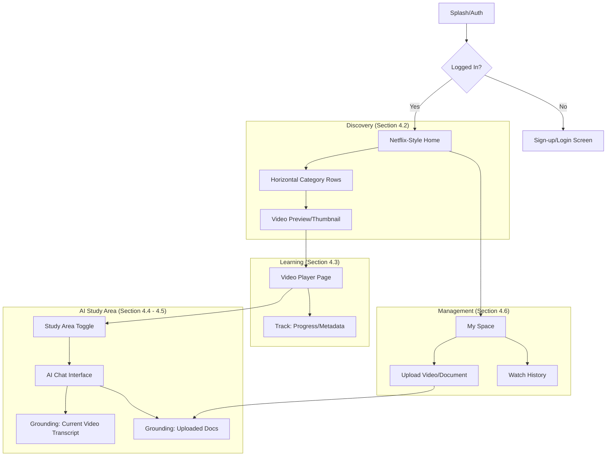

To design the best app flow for **NEST.ai** while leaning into the "vibe coding" philosophy—which prioritizes intuitive transitions, minimal friction, and a seamless "flow state" for the learner—we need to map out a journey that feels less like a database and more like a conversation.

Based on your PRD (Sections 4.2–4.6), here is the optimized app flow designed for a high-performance, AI-driven learning experience.

---

### 1. The NEST.ai "Master Flow" (Visual Logic)

This diagram represents the three-tier hierarchy of the app: **Discovery**, **Consumption**, and **Assistance**.

---

### 2. Detailed Flow Logic for "Vibe Coding"

To achieve the "Netflix-style" UX mentioned in your PRD, the flow must prioritize **non-linear navigation**.

#### Flow A: The Discovery-to-Watch Loop
*   **Entry:** User lands on the Home Feed.
*   **Interaction:** Vertical scroll for categories (Subject/Topic), horizontal scroll within categories (Metadata capture).
*   **The Vibe:** When a user clicks a video, the transition should feel like an "expansion" rather than a page load.
*   **Data Trigger:** Upon video load, the backend immediately starts preparing the **Transcript Embeddings** for the AI Agent (as per Section 5.1).

#### Flow B: The "Context Pivot" (The Magic Step)
This is the core differentiator of NEST.ai (Section 2).
1.  **User Action:** While watching, the user hits a "Doubt?" button or hotkey.
2.  **Transition:** The video player scales down or moves to a split-screen (PIP) view.
3.  **AI Activation:** The **Study Area** (Section 4.4) opens. The AI pre-fills the context: *"I see you're watching [Topic] by [Educator]. How can I help?"*
4.  **Verification:** User asks a question; AI responds using the transcript of the specific timestamp the user was at.

#### Flow C: The Document-Augmentation Flow
1.  **Entry:** User enters **My Space** (Section 4.6).
2.  **Action:** Uploads a PDF/DOCX (Section 4.5).
3.  **Processing:** Asynchronous AI processing (Section 9) extracts text and creates embeddings.
4.  **The Result:** The document now appears as a "Source" in the Study Area. The user can now ask: *"Compare what's in this video to the PDF I just uploaded."*

---

### 3. UI/UX "Vibe" Guidelines (Per Section 6)

To maintain the "Modern Edtech Aesthetic," follow these navigation rules:

*   **The "Three-Tap" Rule:** A user should be able to ask the AI a question from any video in no more than 3 taps/clicks.
*   **Persistent Navigation:** Use a bottom bar (mobile) or sleek side rail (desktop) with three core icons: **Home**, **Study Area**, and **My Space**.
*   **Stateful Chat:** The AI Chat in the "Study Area" should remember the current video's context even if the user navigates away to "My Space" and back.
*   **Feedback Loops:** Use soft color pulses (Section 6) to indicate when the AI is "listening" or "reading" a newly uploaded document.

---

### 4. Implementation Checklist for Vibe Coding

If you are using an AI-assisted coding workflow to build this prototype, use these "logical prompts" to generate the flow:

1.  **Global State:** "Create a React/Next.js context that tracks the `activeVideo`, `currentTimestamp`, and `uploadedDocs` across all pages."
2.  **Navigation:** "Build a Netflix-inspired layout with a sticky header and horizontal scroll rows that pass `videoID` metadata to a dynamic `/watch/[id]` route."
3.  **The Study Bridge:** "On the Video Player page, implement a side-drawer component for the AI Chat that automatically fetches the transcript of the currently playing video ID."
4.  **Context Injection:** "Create a prompt-engineering utility that merges `video_transcript_segment` and `user_query` before hitting the LLM API."

### Summary of the Best Flow for NEST.ai:
The flow should be **Circular**, not Linear. 
**Home (Discover) $\rightarrow$ Player (Consume) $\leftrightarrow$ Study Area (Interact) $\leftrightarrow$ My Space (Manage).** 

The most important "vibe" is the **$\leftrightarrow$ (interaction)** between the Video Player and the Study Area—this is where the "AI agent watches alongside the student" vision truly comes to life.